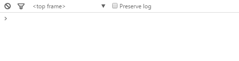
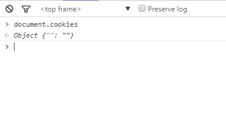

Cookies
=======

A library to browser that allowing control cookies.







Install
------------

```javascript
bower install cookies
```


How get cookies?
----------------

Without:

```javascript
document.cookie
// "a=b; username=Juan Jhon; timezone=usd; lang=en"
```


With:

```javascript
document.cookies
// Object {a: "b", username: "Juan Jhon", timesone: "usd", lang: "en"}
```


How create cookies?
-------------------

Without:

```javascript
document.cookie = "username=Juan Jhon; expires=Thu, 26 Nov 2015 04:07:24 GMT; path=/";
```


With:

```javascript
document.cookies = {
	"name": "username",
	"value": "Juan Jhon",
	"expires": new Date(2015, 11, 26),
	"path": "/"
};
```

Or:

```javascript
document.cookies = {
	"name": "username",
	"value": "Juan Jhon",
	"expires": 1448510844195,
	"path": "/"
};
```

Or:

```javascript
document.cookies = "username=Juan Jhon; expires=Thu, 26 Nov 2015 04:07:24 GMT; path=/";
```

Or:

```javascript
document.cookies = ["username=Juan Jhon; expires=Thu, 26 Nov 2015 04:07:24 GMT; path=/"];
```

Or:

```javascript
document.cookies = {
	"username": "Juan Jhon; expires=Thu, 26 Nov 2015 04:07:24 GMT; path=/"
};
```


